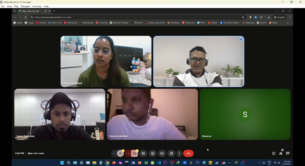
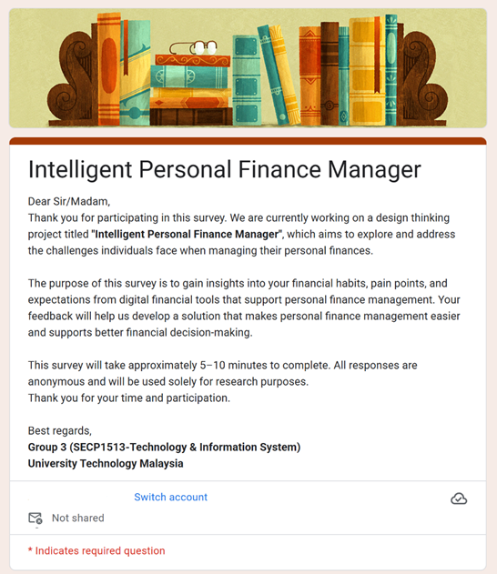
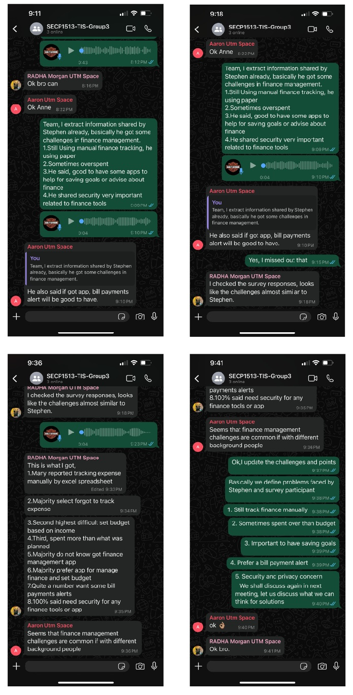
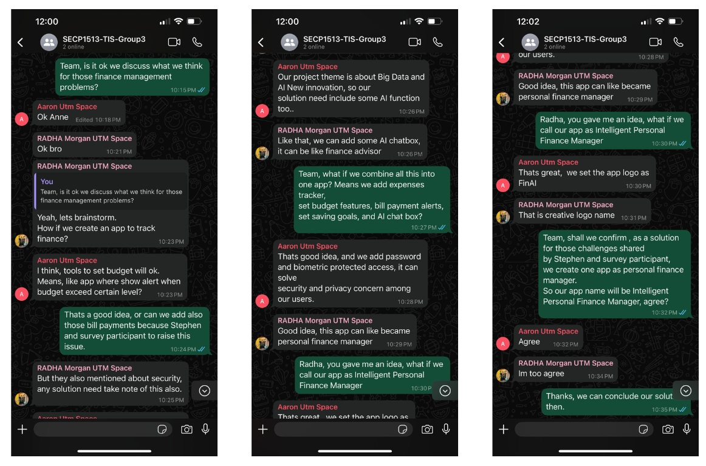
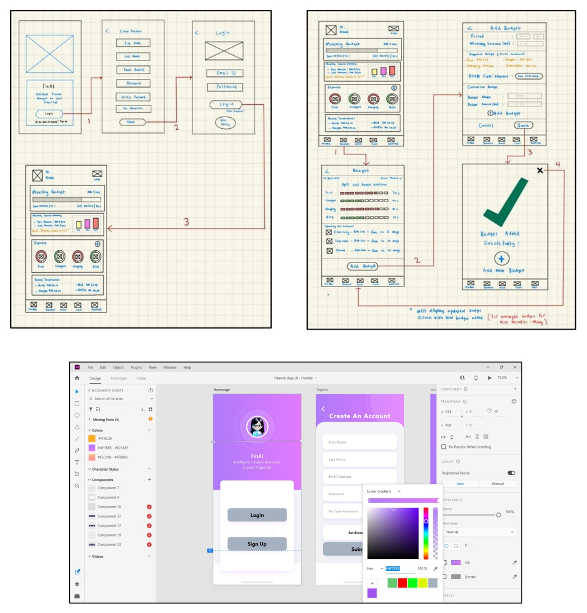
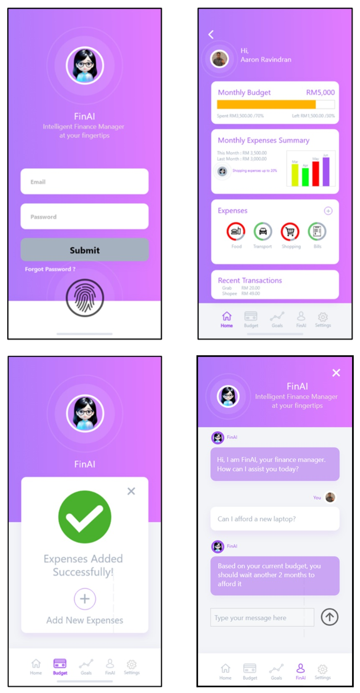
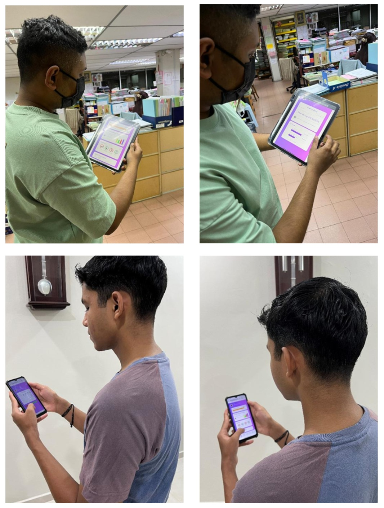

# SECP1513-Technology and Information System

### Course Summary:

This course serves as an introduction to Information Systems and Technology (IS/IT), focusing on their practical uses in both home and professional settings. It covers a range of topics, including hardware, software, networking, and communications. We will develop our practical skills in PC installation and using productivity software through hands-on lab activities. The course also features industry visit and guest lecture, which will offering us the chance to engage with professionals and gain insights into the workplace. Additionally, through this course we will explore IT career options and the specific skills required for various roles in the industry.

# 

### Chapter Lists:
1.	<b>Emerging Technology in ICT </b>   
2.	<b>Hardware </b> 
    Assignment:  
    👉 [Jigsaw Activity](https://github.com/arul1001/SECP1513-Technology-and-Information-System/blob/cb79981214131086eea4f561b754d96cdc529314/Jigsaw_Activity_Group3_System_Unit_and_Its_Componnets.pdf)  
    👉 [Jigsaw Summary](https://github.com/arul1001/SECP1513-Technology-and-Information-System/blob/cb79981214131086eea4f561b754d96cdc529314/Jigsaw_Group%20Summary.pdf
)
3.	<b>Software </b> 
    Assignment:  
    👉 [Open Ended Questions](https://github.com/arul1001/SECP1513-Technology-and-Information-System/blob/f262a1006fa9d23a1e6b03b04a8d7969827ca378/Chapter3_Software-Open-Ended_Questions.pdf)  
6.	<b> Information System & Methodology </b>
7.	<b> Database and Data Analytics </b>
8.	<b> Network and Communications </b>
9.	<b> Privacy, Security, and Ethics </b>
10.	<b> Cloud Computing </b>

# 

### Industry Talk:
1. <b>Industry Talk 1 : Navigating the ICT Job Market-Trends, Opportunities, and Skills for Success </b>  
   Assignment:  
   👉 [Poster Industry Talk 1](https://github.com/arul1001/SECP1513-Technology-and-Information-System/blob/389927d5028822f09f8d0d9664099ae100bade86/Group3_SECP1513_Industry_Talk1.pdf
)
3. <b>Industry Talk 2 : University vs Industry : What Skills Really Matter? </b>  
   Assignment:  
   👉 [Poster - Industry Talk 2 - Presenter](https://github.com/arul1001/SECP1513-Technology-and-Information-System/blob/389927d5028822f09f8d0d9664099ae100bade86/Group3_Industry_Talk2_Presenter.pdf
) 
5. <b> Industry Talk 3 : Surviving the IT Burnout-Startegies for Work-Life Balance in Tech </b>  
   Assignment:  
   👉 [Poster Industry Talk 3](https://github.com/arul1001/SECP1513-Technology-and-Information-System/blob/389927d5028822f09f8d0d9664099ae100bade86/Group3_SECP1513_Industry_Talk3.pdf
)
7. <b> Industry Talk 4 : Generative AI in ICT-Transforming the Future of Innovation </b>  
   Assignment:  
   👉 [Academic Writing - Industry Talk 4](https://github.com/arul1001/SECP1513-Technology-and-Information-System/blob/212c563426ebb9a4c78cb5902a5d9c65720a90a3/Group3_Industry-Talk4-Academic_Writing_Generative_AI_In_ICT.pdf
)

# 

### Design Thinking Project:
 

 This project applies the Design Thinking methodology, a human centered and solution focused approach to solving real world challenges. Under the theme “Big Data and Artificial Intelligence New Innovation,” our team explored the growing difficulties individuals face in managing personal finances amid rising inflation and increasing cost of living. The result is FinAI, a mobile application designed to help users track expenses, manage budgets, set savings goals, and receive bill alerts using AI powered insights. The project focuses on practical, secure, and user friendly financial management supported by intelligent data. 

                  

Below is a brief overview of our project journey through each phase of the Design Thinking process, along with visuals of our work at each stage.

1. <b>Empathize Phase</b>  
We conducted interview and survey to understand user pain points in personal finance management. 

  

  

 

2. <b>Define Phase</b>  
We identified key problems such as lack of budgeting habits and finance saving goals.

  

 

3. <b>Ideate Phase</b>  
We brainstormed and evaluated ideas, then selected the most practical and impactful solution.

  

 

5. <b>Prototype Phase</b>  
We developed a low-fidelty prototype of the mobile application, focusing on core features like budgeting and expense tracking.

  

  

 

6. <b>Testing Phase</b>  
We gathered feedback through user testing and refined our solution based on user input.

  

 

Our Design Thinking Project Report : 👉 [Design Thinking Project Report](https://github.com/arul1001/SECP1513-Technology-and-Information-System/blob/2d361da5f46ee585c72474fbb062301e2e86f6c8/Design_Thinking_Report_Group3.pdf)

Our Design Thinking Project Demonstration Video : 👉 [Design Thinking Project Demonstration Video](https://youtu.be/G494gx8Q5Bc)

#
### My Reflection on SECP1513-Technology and Information System Course

 

This course has given me a comprehensive introduction to Information Systems and Technology, both in theory and practice. Throughout the semester, I engaged in various assignments that deepened my understanding of core IT concepts. The jigsaw activity on computer hardware chapther helped me understand  to computer hardware and system in a collaborative way.

I also explored different types of Operating System and their applications through open-ended assigment in Chapter 3-software, which enhanced my critical thinking and digital literacy.
    
The most impactful part of the course was the series of industry talks, where I created posters, participated as a presenter, and gained real insights into the ICT job market, required industry skills, managing burnout in tech, and the future of Generative AI. These sessions helped me connect classroom knowledge with real-world applications.

Finally, the Design Thinking project allowed me to apply what I learned by developing an AI-based solution for personal finance management. This experience strengthened my problem-solving, teamwork, and creative thinking skills.

Overall, the course helped me better understand the IT field and inspired me to explore career opportunities in the tech industry. 

#
